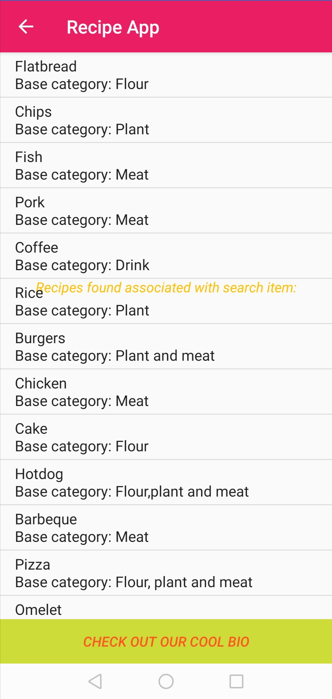
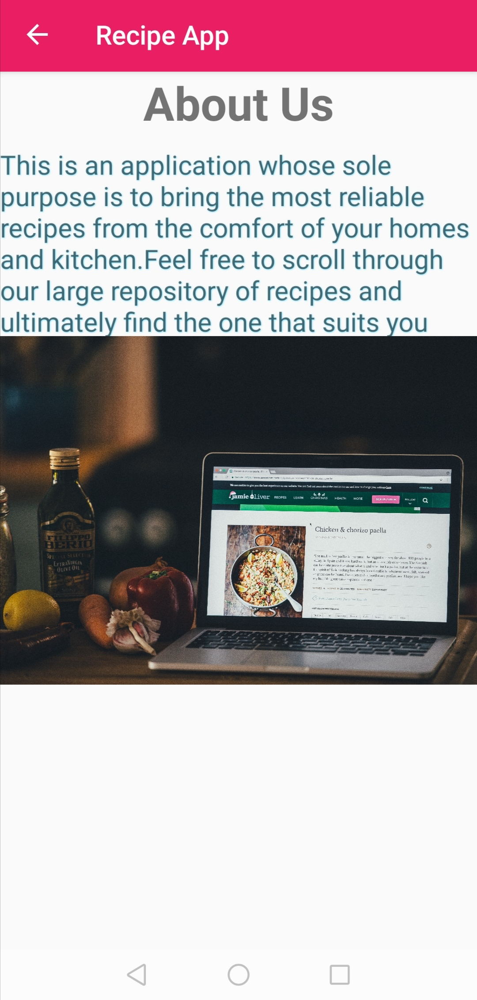

# PROJECT NAME. :hamburger::fries::waffle:
The project is titled 'recipe app'. The project basically functions as the title suggests.

## AUTHOR NAME.
My name is Samuel and i am currently a learning software programmer at Moringa School.:man_technologist::man_technologist:

## DESCRIPTION OF PROJECT.
The project is a Java Android-platform based recipe application whereby one is able to look up recipes to various classes of food. :medal_military::medal_military::trophy:
  

### PROJECT SETUP INSTRUCTIONS.
1. Fork this repository.
2. Clone this repository onto your local machine through use of the command `git clone <Forked-repository-link.>`. 
3. Navigate to your terminal.
4. Navigate the the appropriate directory by use of cd command `cd<root-folder>`.
5. In order to make any additional changes to the project, it is highly adviced that you install Android Studio, the official IDE for Android.(Integrated Development Environment).
                                                                                                                                                                                                                                                                                                                                                                                                                                                                                                                                                                                                                                                                                                                                                                                                                                                                                                                                                                                                                                                                                                                                                                                                                                                                                                                                                                                                                                                                                                                                                                                                                                                                                                                                                   
### TECHNOLOGIES USED.
- Java.
- Gradle.
- JUnit.
- [Android Studio](https://developer.android.com/studio).
- [Roboelectric](http://robolectric.org/) for unit testing.
- [Espresso](https://developer.android.com/training/testing/espresso) for instrumentation testing.

### KNOWN BUGS.
---------

### CONTACT INFORMATION.
For more information, feel free to contact me through the email address: samdot@gmail.com

### LICENCE AND COPYRIGHT INFORMATION.
Copyright :copyright: 2020-present

Permission is hereby granted, free of charge, to any person obtaining a copy
of this software and associated documentation files (the "Software"), to deal
in the Software without restriction, including without limitation the rights
to use, copy, modify, merge, publish, distribute, sublicense, and/or sell
copies of the Software, and to permit persons to whom the Software is
furnished to do so, subject to the following conditions:

The above copyright notice and this permission notice shall be included in all
copies or substantial portions of the Software.

THE SOFTWARE IS PROVIDED "AS IS", WITHOUT WARRANTY OF ANY KIND, EXPRESS OR
IMPLIED, INCLUDING BUT NOT LIMITED TO THE WARRANTIES OF MERCHANTABILITY,
FITNESS FOR A PARTICULAR PURPOSE AND NONINFRINGEMENT. IN NO EVENT SHALL THE
AUTHORS OR COPYRIGHT HOLDERS BE LIABLE FOR ANY CLAIM, DAMAGES OR OTHER
LIABILITY, WHETHER IN AN ACTION OF CONTRACT, TORT OR OTHERWISE, ARISING FROM,
OUT OF OR IN CONNECTION WITH THE SOFTWARE OR THE USE OR OTHER DEALINGS IN THE
SOFTWARE.
